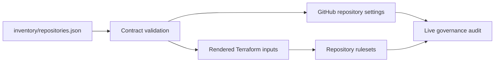

# bijux-iac

`bijux-iac` is the live GitHub governance control plane for the Bijux
repository family. It turns a reviewed repository inventory into organization
settings and `main` branch rulesets, then audits GitHub to prove that the
declared policy is active.

The repository is intentionally narrow. It owns live administration; it does
not own product code, package release logic, or the shared files synchronized
into each repository.

## Why This Repository Exists

Repository settings are part of the production platform. If they are changed
manually, the family can drift in ways that are difficult to review or
reproduce: merge methods diverge, required checks disappear, stale branches
accumulate, or a renamed repository remains in an old policy list.

`bijux-iac` provides one reviewable path:



Every write is derived from the committed inventory. Generated Terraform
inputs are checked into the repository so pull requests show the exact target
set before an apply can run.

## Ownership Boundaries

| Surface | Owner | Responsibility |
| --- | --- | --- |
| Live GitHub settings and rulesets | `bijux-iac` | Visibility, features, merge policy, branch deletion, sign-off policy, and `main` protection |
| Shared repository standards | `bijux-std` | Managed Make libraries, GitHub workflow sources, checks, documentation shell, generators, and checksums |
| Product behavior | Product repository | Domain code, package metadata, tests, release inputs, and product documentation |
| Portfolio website | `bijux.github.io` | Public landing site and links to published project documentation |

Managed content under `.bijux/shared/` and selected `.github/` paths is consumed
from the exact commit recorded in
[`.github/standards/bijux-std.sha`](.github/standards/bijux-std.sha). Those files
must be refreshed through the standards tooling, not edited locally.

## Governed Family

The inventory contains the complete twelve-repository family. Delivery state is
operational metadata: `published` means the public surface exists,
`planned` means it is deliberately not yet published, and `not-applicable`
means that repository does not own the surface.

| Repository | Role | Stack | Documentation | Packages |
| --- | --- | --- | --- | --- |
| `bijux-iac` | GitHub control plane | Terraform | Not applicable | Not applicable |
| `bijux-std` | Shared standards control plane | Python | Not applicable | Not applicable |
| `bijux.github.io` | Portfolio website | Docs | Published | Not applicable |
| `bijux-masterclass` | Course website | Docs | Published | Not applicable |
| `bijux-canon` | Product | Python | Published | Published |
| `bijux-proteomics` | Product | Python | Published | Published |
| `bijux-pollenomics` | Product | Python | Published | Published |
| `bijux-phylogenetics` | Product | Python | Published | Published |
| `bijux-core` | Product | Rust | Published | Published |
| `bijux-atlas` | Product | Rust | Published | Published |
| `bijux-gnss` | Product | Rust | Published | Published |
| `bijux-genomics` | Product | Rust | Planned | Planned |

Validation fails if a family member is missing, duplicated, renamed, assigned
the wrong stack, or given a delivery state that contradicts this contract.
This makes the `bijux-gnss` identity durable and prevents obsolete repository
names from re-entering the control plane.

## Repository Layout

| Path | Purpose |
| --- | --- |
| [`inventory/repositories.json`](inventory/repositories.json) | Authoritative family, settings, delivery state, and ruleset inputs |
| [`scripts/`](scripts) | Inventory validation, deterministic rendering, settings application, and live audit |
| [`infra/github/main-branch-protection/`](infra/github/main-branch-protection) | Terraform module for legacy branch protection and current repository rulesets |
| [`tests/`](tests) | Executable family and rendering contracts |
| [`makes/`](makes) | Repository-owned composition of shared Make foundations |
| [`.bijux/shared/`](.bijux/shared) | Generated standards payload selected by capability |

## Governance Model

All managed repositories currently use an active ruleset targeting the default
branch. The baseline requires:

- pull requests for changes to `main`
- merge commits as the only merge method
- stale reviews dismissed after new pushes
- review conversations resolved before merge
- strict required status checks
- force pushes rejected
- branch deletion rejected

The baseline check contexts are:

- `policy / github`
- `policy / pr approval`
- `std / standard`
- `std / report`

Repository-specific checks may be added in the inventory. The current Python
release repositories also require `verification-ready` where that workflow is
available.

Merged pull-request branches are deleted automatically at the repository
settings layer. That setting does not weaken the ruleset prohibition against
deleting `main`.

## Change Flow

1. Edit [`inventory/repositories.json`](inventory/repositories.json).
2. Run `make test` to validate schema, family membership, delivery state, and
   generated Terraform parity.
3. If branch policy changed, regenerate the committed input:

   ```bash
   python3 scripts/render_main_branch_protection_tfvars.py --write
   ```

4. Run the repository gates:

   ```bash
   make fmt
   make lint
   make ci
   ```

5. Open a pull request. The plan workflow validates the inventory, imports live
   ruleset state, and produces a Terraform plan without changing GitHub.
6. Merge only after required checks pass. The serialized apply workflow first
   patches repository settings, then imports current rulesets and applies
   Terraform.
7. The workflow audits live settings and rulesets after apply. The same audit
   is available locally:

   ```bash
   make live-audit
   ```

The apply workflow uses no persistent Terraform backend. It imports live
resources into an ephemeral runner state on every execution. This avoids
committing or centrally storing state, but it makes the import step mandatory;
an import failure stops the apply rather than attempting an unowned write.

## Local Commands

Run commands from the repository root.

| Command | Purpose |
| --- | --- |
| `make help` | Show the supported repository interface |
| `make doctor` | Verify required local tools and artifact boundaries |
| `make test` | Run fast inventory, rendering, syntax, and family contracts |
| `make fmt` | Verify Terraform formatting without modifying source |
| `make lint` | Run contracts and Terraform initialization/validation |
| `make contract-tests` | Run network-free governance contracts used by standards CI |
| `make bijux-std-checks` | Verify managed content against the pinned `bijux-std` commit |
| `make ci` | Run the pull-request gate composition |
| `make live-audit` | Compare inventory with live GitHub settings and rulesets |

Generated providers, Python bytecode, reports, and other local output are
contained under `artifacts/`.

## Prerequisites

Local validation requires:

- Python 3.11 or newer
- Bash
- Terraform 1.6 or newer
- GitHub CLI for live settings operations

The apply and live-audit paths require a GitHub token with repository
administration permission across the governed family. GitHub Actions reads it
from the `GH_ADMIN_TOKEN` repository secret. Do not place tokens in Terraform
variables, inventory files, shell history, or committed artifacts.

## Failure Policy

Validation fails closed. The repository does not silently omit unknown family
members, missing required checks, unsupported delivery states, malformed
settings, generated-input drift, failed imports, or live audit differences.
Fix the declared source or the live control plane; do not weaken a check to
hide the mismatch.

## License

This repository is licensed under the MIT License. Copyright 2026 Bijan
Mousavi <bijan@bijux.io>. See [`LICENSE`](LICENSE).
