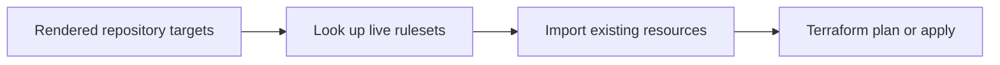

# GitHub Main Branch Governance

This Terraform module owns the protected `main` surface for repositories listed
in [`inventory/repositories.json`](../../../inventory/repositories.json). It is
one half of the live control plane: repository settings are patched through the
GitHub API, while branch protection and repository rulesets are managed here.

## Source and Generated Input

Do not edit
[`terraform.auto.tfvars.json`](terraform.auto.tfvars.json) by hand. It is a
reviewable projection of the inventory produced by:

```bash
python3 scripts/render_main_branch_protection_tfvars.py --write
```

Verify parity from the repository root:

```bash
python3 scripts/validate_repo_inventory.py
python3 scripts/render_main_branch_protection_tfvars.py --check
```

The renderer keeps repository names, protection engine selection, approving
review counts, admin enforcement, and required check contexts aligned with the
authoritative inventory.

## Managed Resources

The module supports two explicit engines:

- `github_repository_ruleset.main` is the current policy for public Bijux
  repositories.
- `github_branch_protection.main` remains available for a repository that must
  retain the legacy API.

Every enabled repository appears in exactly one engine. Current inventory uses
rulesets for all twelve repositories.

The ruleset targets `~DEFAULT_BRANCH`, permits merge commits only, requires
review-thread resolution and strict status checks, and rejects deletion and
non-fast-forward updates. Required check names remain repository-specific
inputs rather than hard-coded Terraform locals.

## State Model

CI deliberately uses ephemeral Terraform state. Before every plan or apply,
[`scripts/import_main_branch_protection.sh`](scripts/import_main_branch_protection.sh)
imports each existing protection resource:



The importer distinguishes a genuinely absent resource from an import error.
An absent rule can be created by Terraform. Authentication failures, API
errors, malformed IDs, and unexpected provider failures stop the run.

This model avoids a persistent backend and committed state, but it has two
consequences:

- imports are required on every fresh runner
- a plan describes the live state observed during that workflow run and should
  be reviewed again after unrelated administrative changes

## Pull Request Plan

The `github-governance-plan` workflow performs:

1. inventory validation
2. generated-input parity
3. Terraform format verification
4. provider initialization
5. live resource import
6. Terraform validation
7. a saved, non-interactive plan

The workflow has read-only repository permissions. GitHub administration is
authorized separately through `GH_ADMIN_TOKEN`.

## Main Branch Apply

The `github-governance-apply` workflow is serialized and runs only on `main` or
manual dispatch. It:

1. validates inventory and generated inputs
2. applies repository settings through `scripts/apply_repository_settings.py`
3. initializes Terraform
4. imports current protection resources
5. applies the reviewed ruleset configuration non-interactively

Settings are patched before rulesets so merge methods and branch cleanup policy
match the rules that Terraform enforces.

## Local Validation

From the repository root:

```bash
make fmt
make lint
make test
```

`make lint` stores Terraform provider data under `artifacts/terraform/data` so
the module directory remains source-only.

To inspect a local plan, provide an administrative token without writing it to
disk:

```bash
export TF_VAR_github_token="$GH_ADMIN_TOKEN"
export TF_DATA_DIR="$PWD/artifacts/terraform/data"
terraform -chdir=infra/github/main-branch-protection init -backend=false
terraform -chdir=infra/github/main-branch-protection validate
```

Import and plan only when the token is authorized for all governed
repositories. Partial administrative access produces an incomplete view and is
treated as a failure.

## Adding or Renaming a Repository

Change the inventory, not this module:

1. add or rename the repository entry
2. define its class, stack, delivery state, settings overrides, and ruleset
   checks
3. update the family contract in `scripts/repository_inventory.py`
4. regenerate `terraform.auto.tfvars.json`
5. run `make test`, `make fmt`, and `make lint`
6. review the plan before merge

Repository renames must remove the obsolete identity in the same change. The
inventory validator rejects unknown or missing family members, preventing both
names from being governed concurrently.

## Credentials

GitHub Actions requires the `GH_ADMIN_TOKEN` secret with repository
administration permission across the family. Terraform receives it as
`TF_VAR_github_token`; the settings script receives it as `GH_TOKEN`.

Never commit credentials, local state, plans, provider caches, or API responses.
All local execution output belongs under the repository `artifacts/` boundary.
